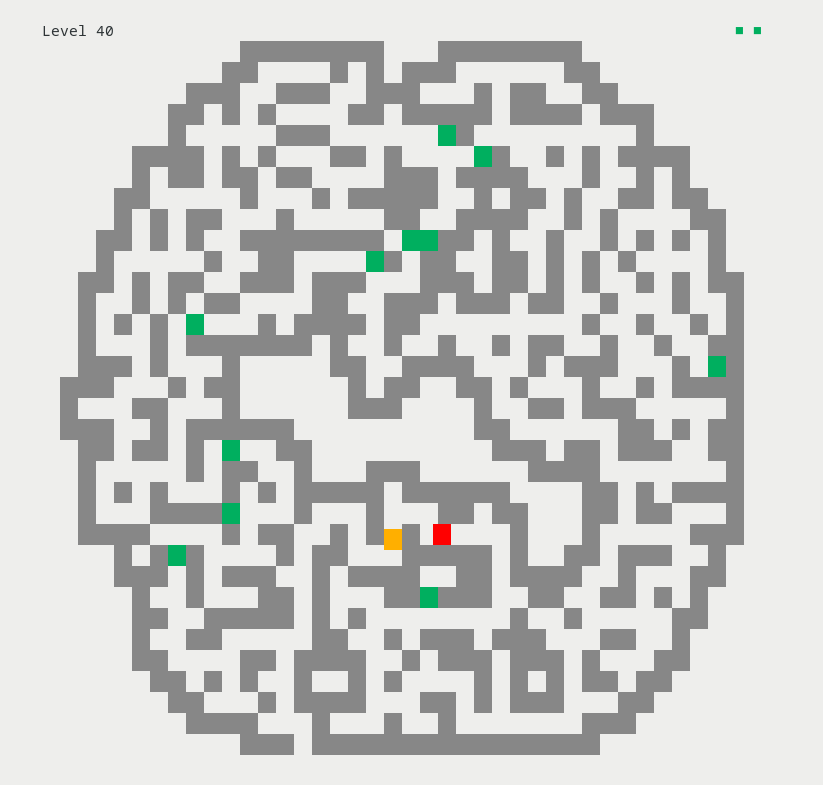
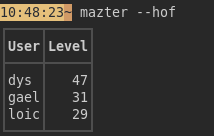
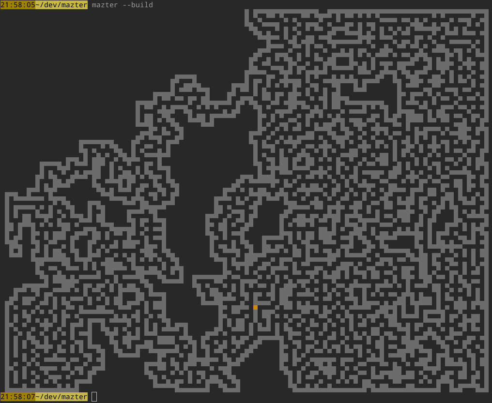

A maze in your terminal.

[![MIT][s2]][l2] [![Latest Version][s1]][l1] [![Chat on Miaou][s4]][l4]

[s1]: https://img.shields.io/crates/v/mazter.svg
[l1]: https://crates.io/crates/mazter

[s2]: https://img.shields.io/badge/license-MIT-blue.svg
[l2]: LICENSE

[s4]: https://miaou.dystroy.org/static/shields/room.svg
[l4]: https://miaou.dystroy.org/3490?mazter

Mazter is a maze game and generator, with fluid moves and an adaptative rendering dynamically finding the resolution which best suits your terminal's size.

<a href="https://asciinema.org/a/ZrdfmWiutEkSKuvavVKUDAf9F?autoplay=true&loop=true" target="_blank"></a>


## Install

Either

* download the precompiled binaries from the [official site](https://dystroy.org/mazter),
* or [install the Rust development environment](https://rustup.rs/) then run `cargo install mazter`

## See options

```bash
mazter --help
```

## Play

Simply run

```bash
mazter
```

Move with the arrow keys to exit the maze.

An encounter with a red monster teleports you a short distance, and removes one life.

You get lives on green squares.



As your accomplishments are saved, you'll start at the first level you didn't already win.

But you may replay a previous level with `mazter --level 3`.

If you're several players on the same account, you should specify who's playing:


```bash
mazter --user Gael
```

You can see the Hall of Fame with `mazter --hof`:



## Just generate a maze

### build a random maze

```bash
mazter --build
```

The maze will always fit your terminal (but not always filling it, you randomly get smaller ones).


### build a maze for a given level

```bash
mazter --build --level 20
```


## Just gaze

With the screen-saver mode, mazter plays by himself, even taking a place in the hall of fame.

```bash
mazter --screen-saver
```


