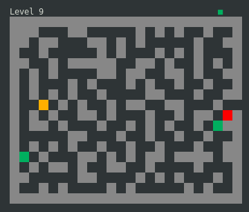

A maze in your terminal.

[![MIT][s2]][l2] [![Latest Version][s1]][l1] [![Chat on Miaou][s4]][l4]

[s1]: https://img.shields.io/crates/v/mazter.svg
[l1]: https://crates.io/crates/mazter

[s2]: https://img.shields.io/badge/license-MIT-blue.svg
[l2]: LICENSE

[s4]: https://miaou.dystroy.org/static/shields/room.svg
[l4]: https://miaou.dystroy.org/3490?mazter

Move with the arrow keys, avoid monsters (or meet them where you want), and go to the exit and the next level.

[Official site, with precompiled binaries and help](https://dystroy.org/mazter)

If you want to compile mazter yourself, first [install the Rust development environment](https://rustup.rs/) then run `cargo install mazter`.
